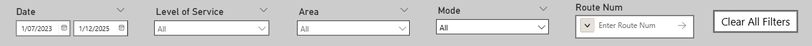
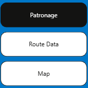
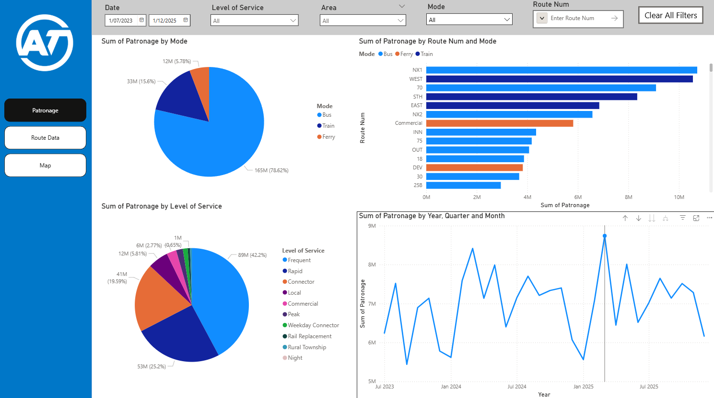
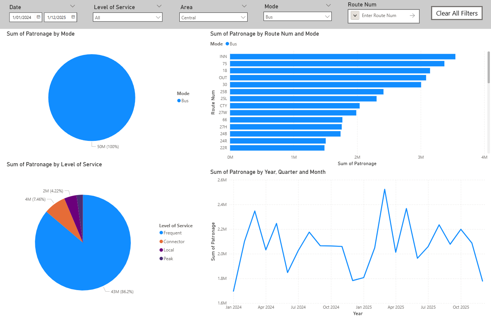
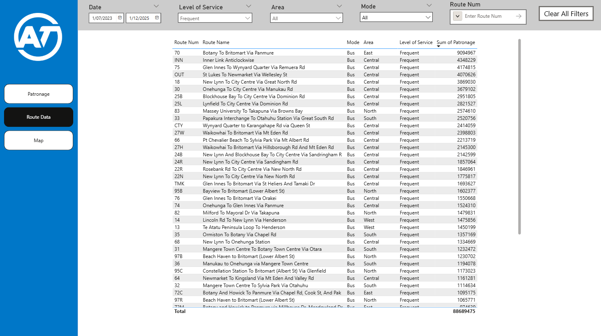
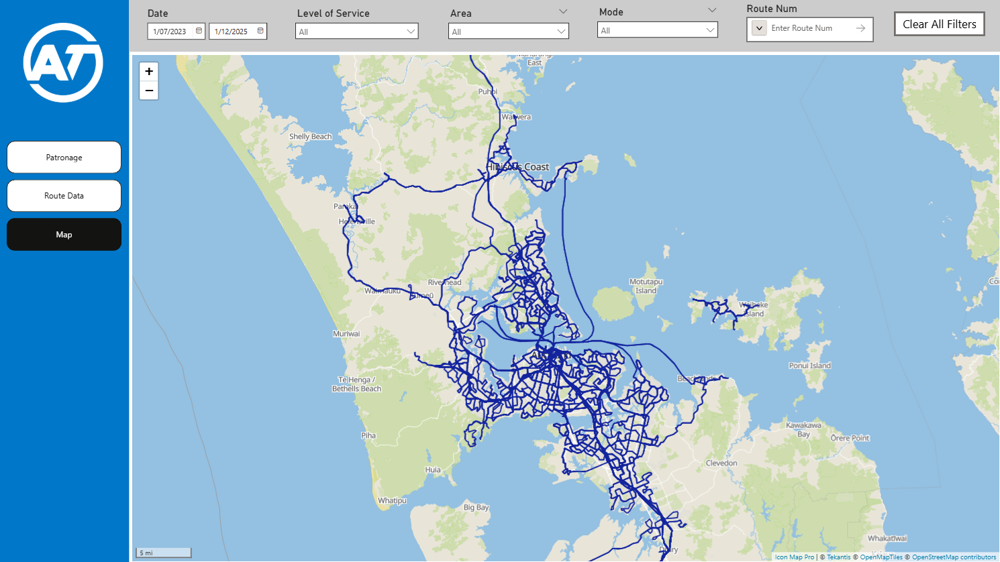
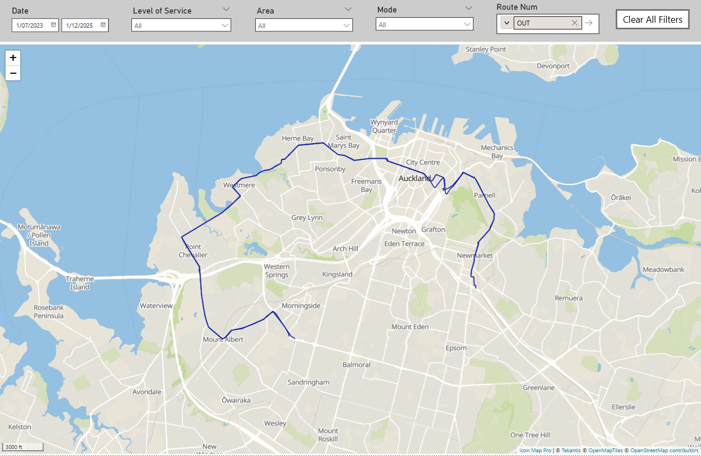
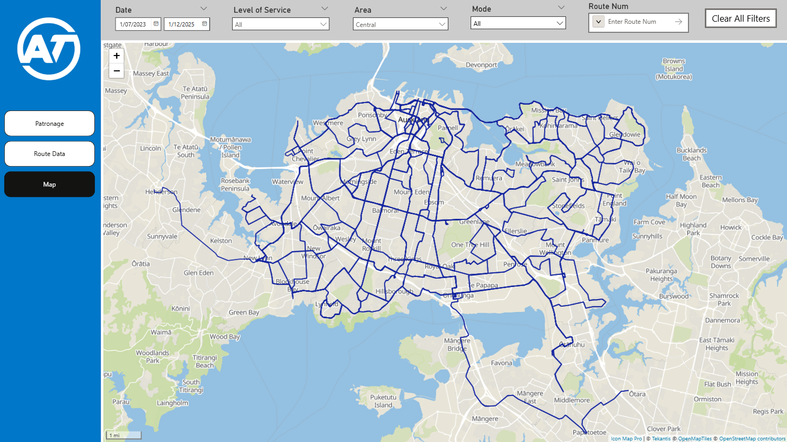

# Auckland Transport Power BI

Interactive Power BI report analysing Auckland Transport data from July 2023 to December 2025, covering bus, train and ferry routes.  

To view the Power BI report, you will need to have Microsoft Power BI installed. Afterwards, you only need to download the ```at_data.pbix``` file.

## Interactive filters

The interactive filters will remain throughout all pages. Use ```ctrl+left_click``` on the Clear All Filters button to clear all filters.




## Navigation 

Use ```ctrl+left_click``` to utilise the page navigator.




## Patronage

The Patronage page displays Auckland Transport patronage through four charts.

- Pie chart showing patronage distribution by mode of transport
- Bar chart comparing patronage by route number and mode
- Pie chart showing patronage distribution by level of service
- Line chart depicting total patronage by date



### Interactive filters

- Date (1/01/24 - 1/12/25)
- Area (Central)
- Mode (Bus)




## Route Data

The Route Data page provides an interactive table displaying data for each route.




## Map

The Map page consists of an interactive map showcasing all the transport routes.



### Interactive filters

- OuterLink route



- Central bus routes




## Data source

Data was sourced from official AT data sources: 

- [Monthly public transport patronage](https://at.govt.nz/about-us/reports-publications/how-many-people-are-taking-buses-trains-and-ferries)
- GTFS coordinate data sourced from the [Auckland Transport GTFS feed](https://at.govt.nz/about-us/at-data-sources/general-transit-feed-specification), with a preprocessed dataset provided by Auckland Transport.

## Preprocessing

- Power Query transformations were utilised to unpivot the date columns and append all 3 monthly patronage tables into one table
- The GTFS coordinate data provided in the ```gtfs_data_preprocess``` folder was further preprocessed with a Python script to construct WKT linestrings from the coordinates. A chunking algorithm was applied to split routes with linestrings exceeding Power BI's character cell limit of 32,767, producing ```coordinates.csv``` for map visualisation


